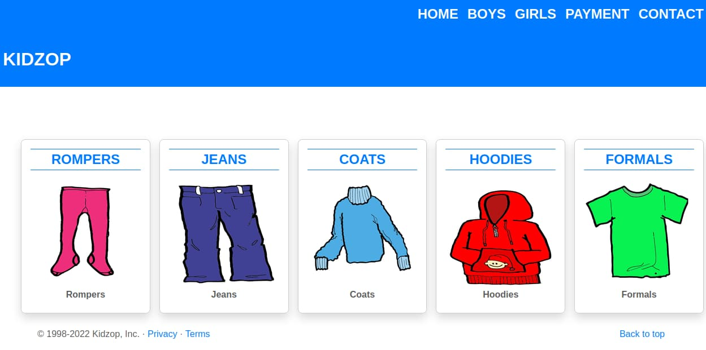

<div align = "center">

<h1><a href="https://2kabhishek.github.io/kidzop">kidzop</a></h1>

<a href="https://github.com/2KAbhishek/kidzop/blob/main/LICENSE">
 </a>

<a href="https://github.com/2KAbhishek/kidzop/graphs/contributors">
 </a>

<a href="https://github.com/2KAbhishek/kidzop/stargazers">
</a>

<a href="https://github.com/2KAbhishek/kidzop/network/members">
 </a>

<a href="https://github.com/2KAbhishek/kidzop/watchers">
 </a>

<a href="https://github.com/2KAbhishek/kidzop/pulse">
 </a>

<h3>Shop for kidz 👚🐥</h3>

<figure>
  
  <br/>
  <figcaption>kidzop screenshot</figcaption>
</figure>

</div>

## What is this

A dummy kids apparel site used for teaching web dev.

## Inspiration

Needed to teach web dev to beginners.

## Prerequisites

Before you begin, ensure you have met the following requirements:

- You have installed the latest version of `a modern web browser`

## Getting kidzop

To get kidzop, follow these steps:

```bash
git clone https://github.com/2kabhishek/kidzop
cd kidzop
npx live-server .
```

## How it was built

kidzop was built using `neovim`

Hit the ⭐ button if you found this useful.

## More Info

<div align="center">

<a href="https://github.com/2KAbhishek/kidzop">Source</a> | <a href="https://2kabhishek.github.io/kidzop">Website</a>

</div>
